# Features

Balance Browser combines a modern macOS browsing experience with productivity tools, AI capabilities, and powerful browsing features.

## Productivity

### Command Palette

Instantly search for browser commands, execute actions, and switch tabs.

### Productive Sidebar

A customizable sidebar that provides quick access to built-in tools such as Notes, History, Downloads, and your favorite pinned websites.

### Split View

View and interact with two websites simultaneously within a single window.

## Customizable Toolbar
Customize the top toolbar by adding, removing, and arranging buttons however you like.
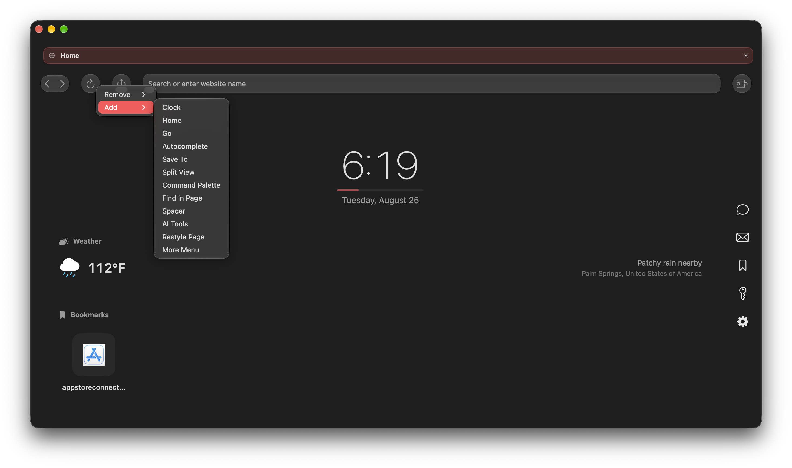

### Focus Mode

A distraction-free browsing environment designed for reading, studying, or concentrating on a single task.

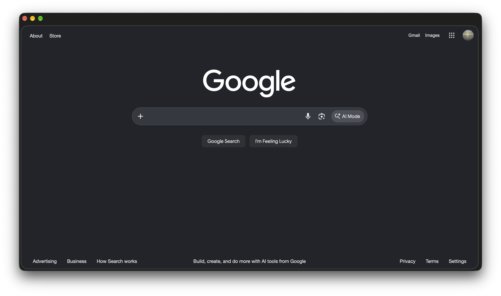

### Notepad

A built-in scratchpad that lets you quickly capture ideas without leaving the browser.

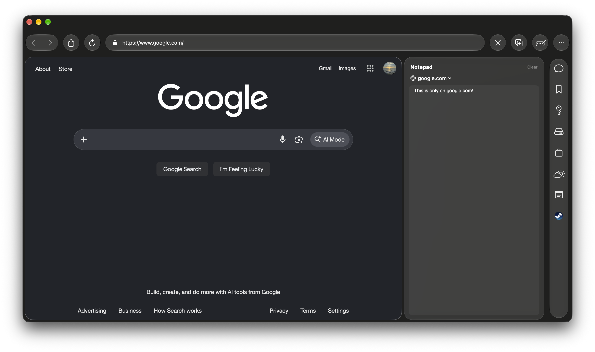

## AI

### Local AI Chat

Chat with a local AI assistant directly inside the browser for brainstorming, coding assistance, writing, and general questions. All conversations stay on your device.

### AI Page Summarization

Generate concise summaries of articles and lengthy web pages using local Apple Foundation Models.

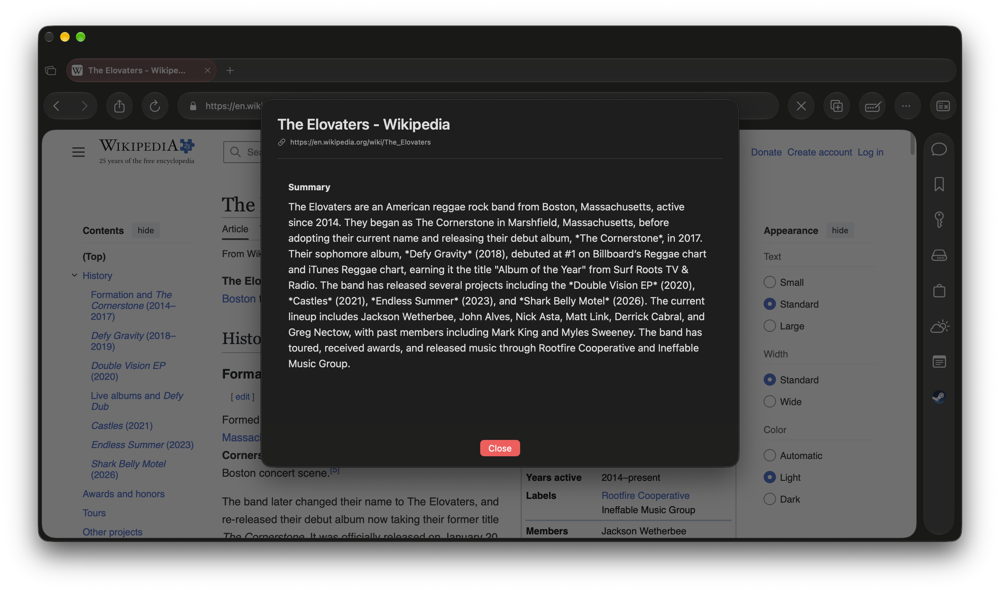

### Event Extraction

Automatically detect event information from supported web pages and export it directly to your Calendar.

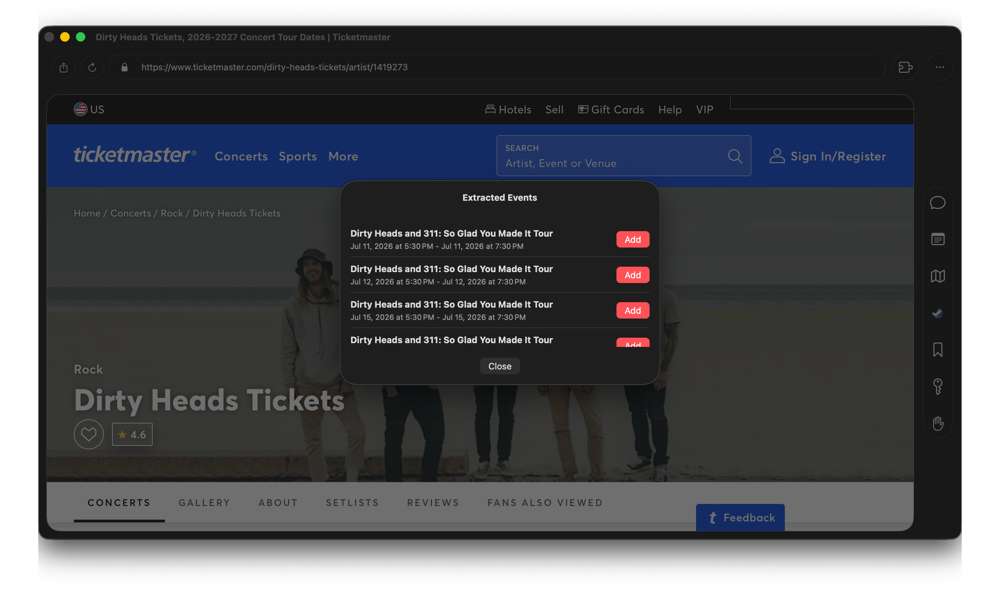

### Map

Extract locations and real-world entities from your open tabs and display them on an interactive map.

## Browsing Experience

### Smart Address Bar

The address bar intelligently determines whether your input is:

* A URL
* A domain (such as `google.com`)
* A search query

It automatically performs the appropriate action without requiring prefixes.

### Reader Mode

Remove clutter and enjoy a clean reading experience powered by Readability.js.

### Page Restyle

Change a page's color or font.

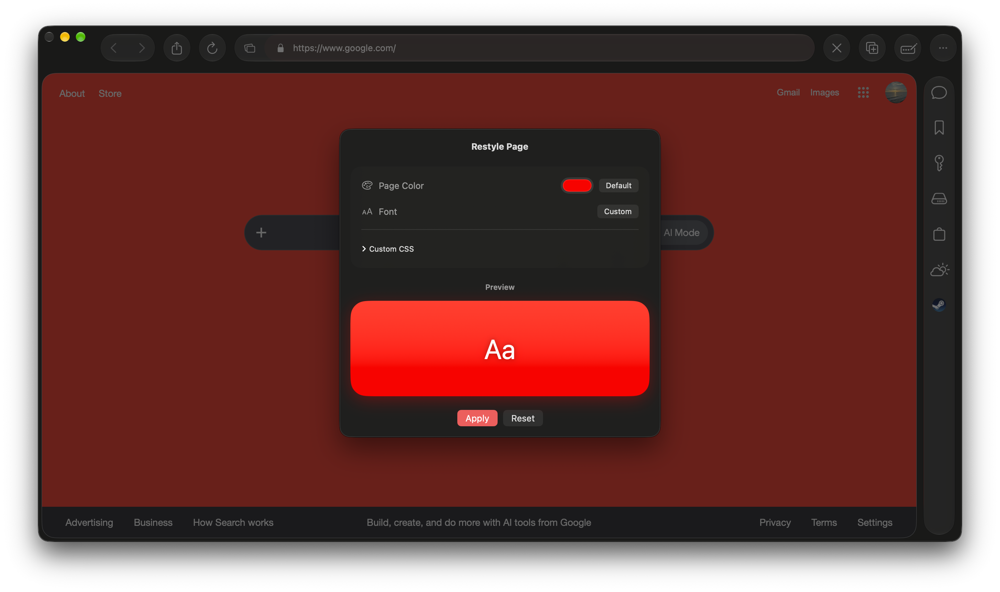

### Native PDF Viewer

Open and browse PDF documents directly inside the browser using PDFKit.

### RSS Feeds

Add RSS feeds to your Sidebar.

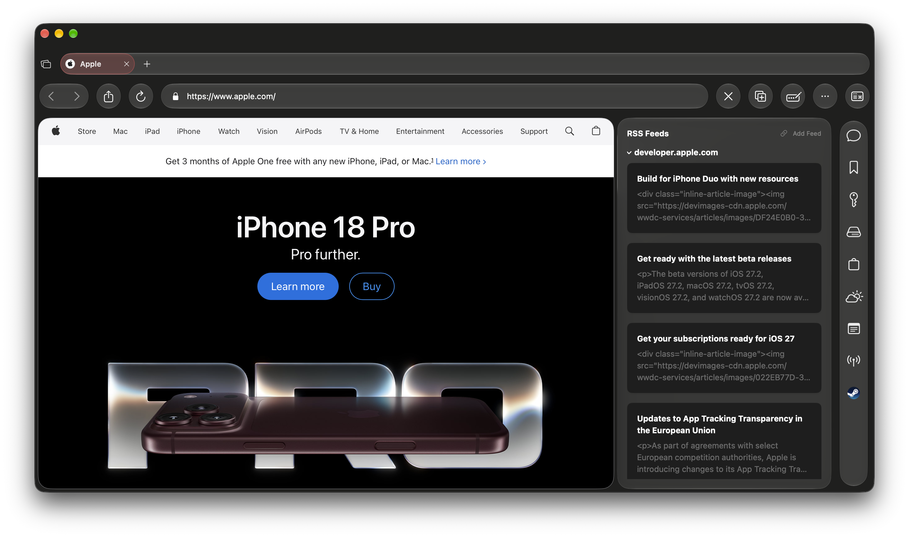

### Password Manager

Save & autofill passwords on websites.

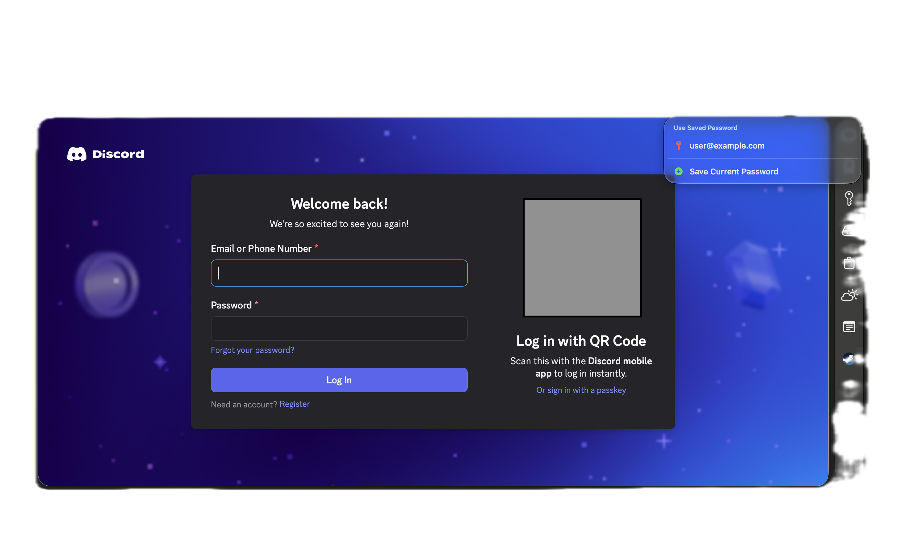

### Advanced Tabs & Windows

Manage browsing efficiently with features including:

* Duplicate Tabs
* Move Tabs to New Windows
* Tab Search
* Multiple Browser Windows

### Profiles

Keep browsing data separate using independent browser profiles.

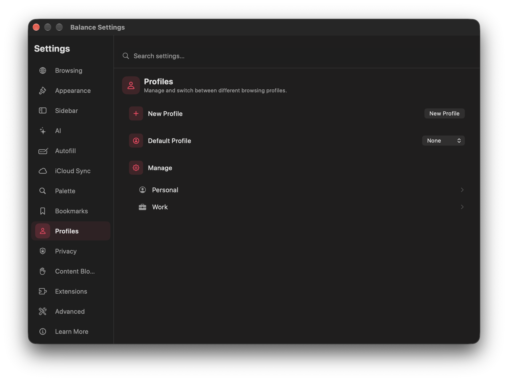

And add IMAP to a profile to see your unread emails.

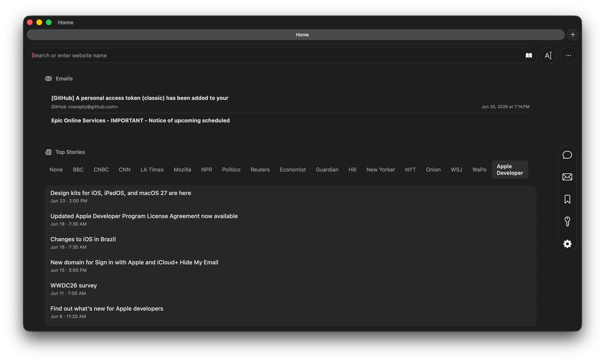

### Extensions Support

Install compatible extensions directly from the Chrome Web Store to extend browser functionality.

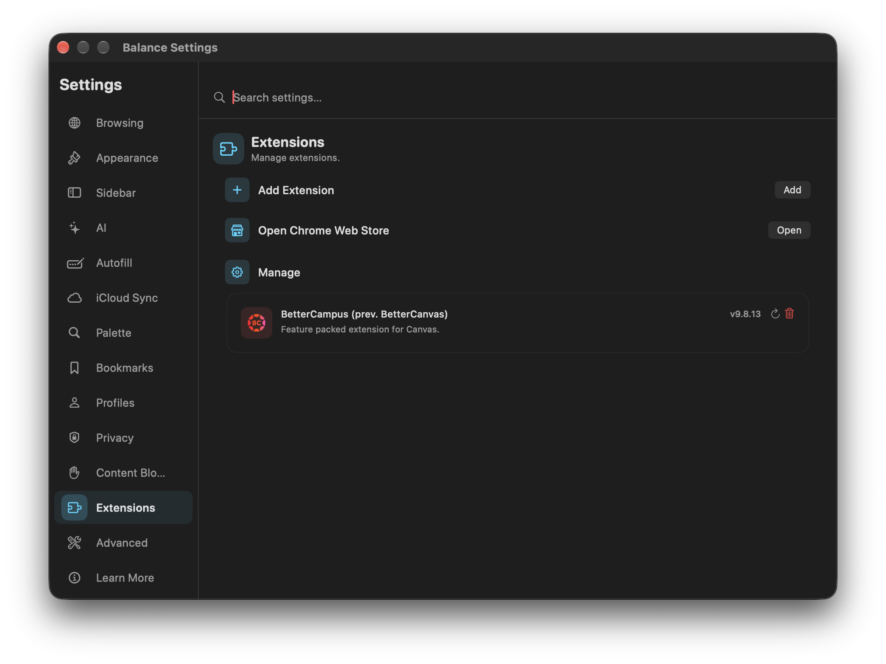

## Customization

Balance Browser offers extensive customization options, including:

* Homepage selection
* User Agent switching
* Bookmark Bar display modes
* Persistent browser preferences
* Sidebar customization

## Privacy & Security

Built-in protections include:

* Content Blocking
* Site Permission Management
* Server Trust Verification
* Local AI processing
* Optional browsing history

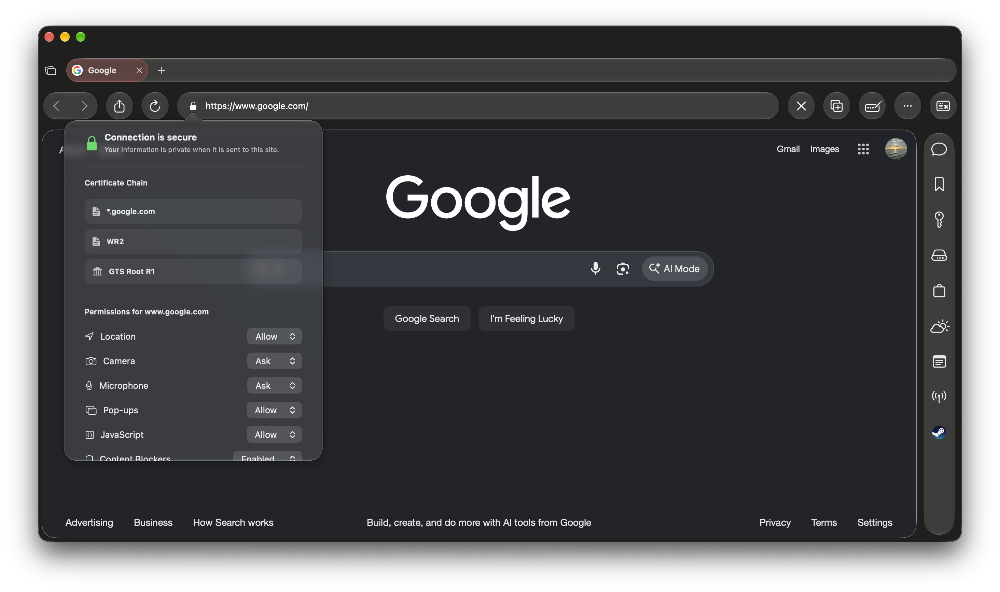

## Weather
See weather for any city in the Sidebar.
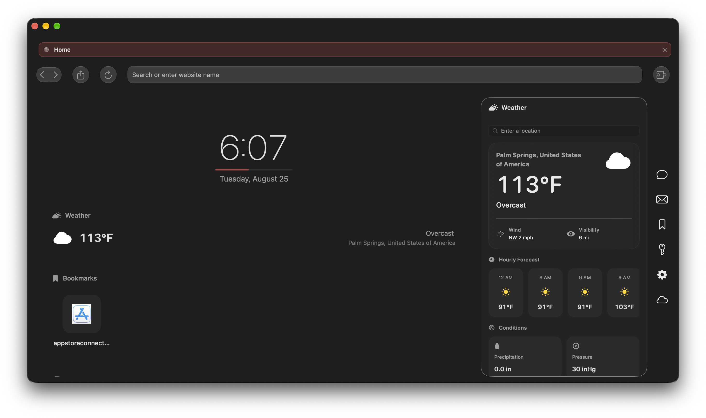

## Design

### Liquid Glass UI

A native macOS interface inspired by the latest system design language, featuring depth and translucency throughout the browser.

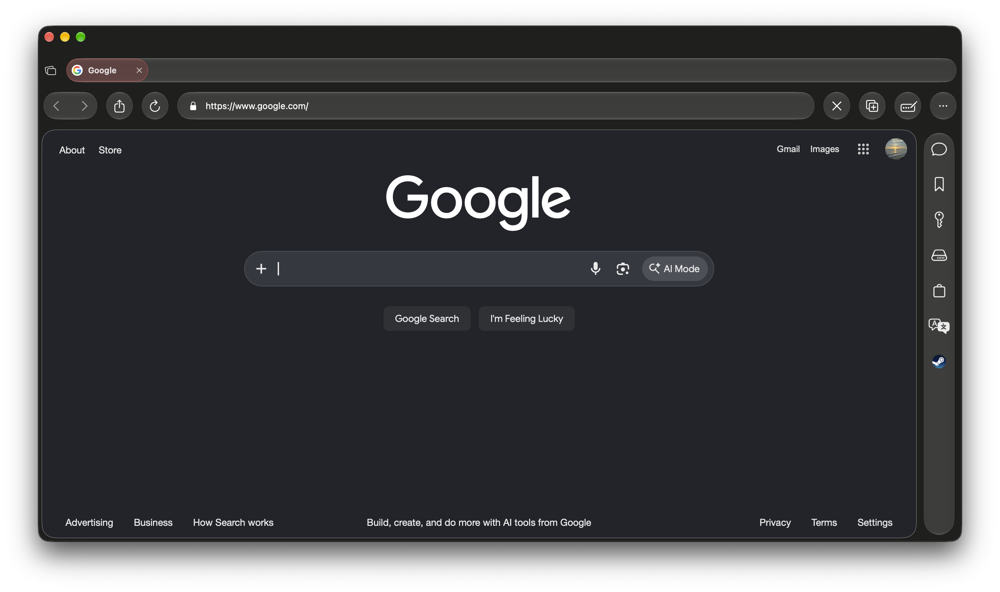

### Vertical Tabs
Use horizontal or vertical tabs, or hide them entirely. Balance gives you the flexibility to manage your tabs in a way that works for you.

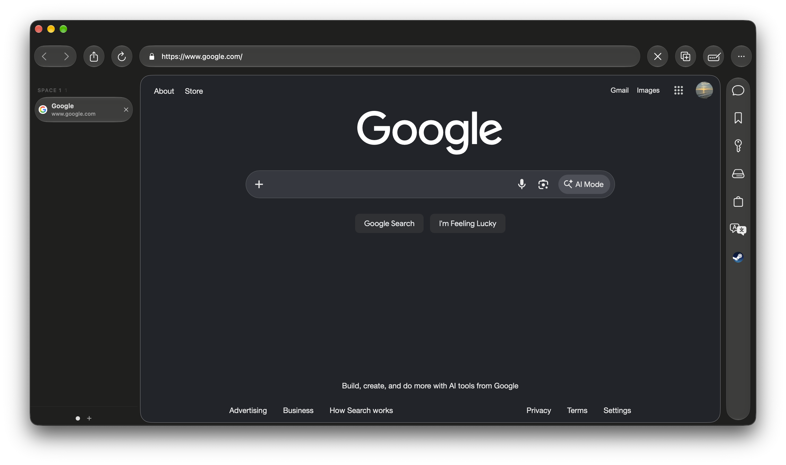