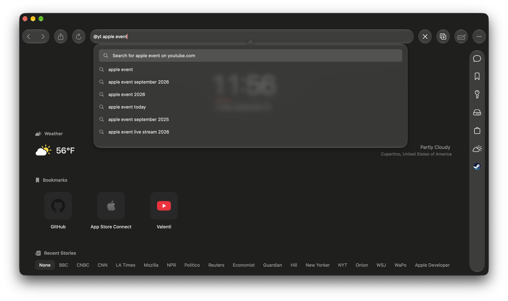
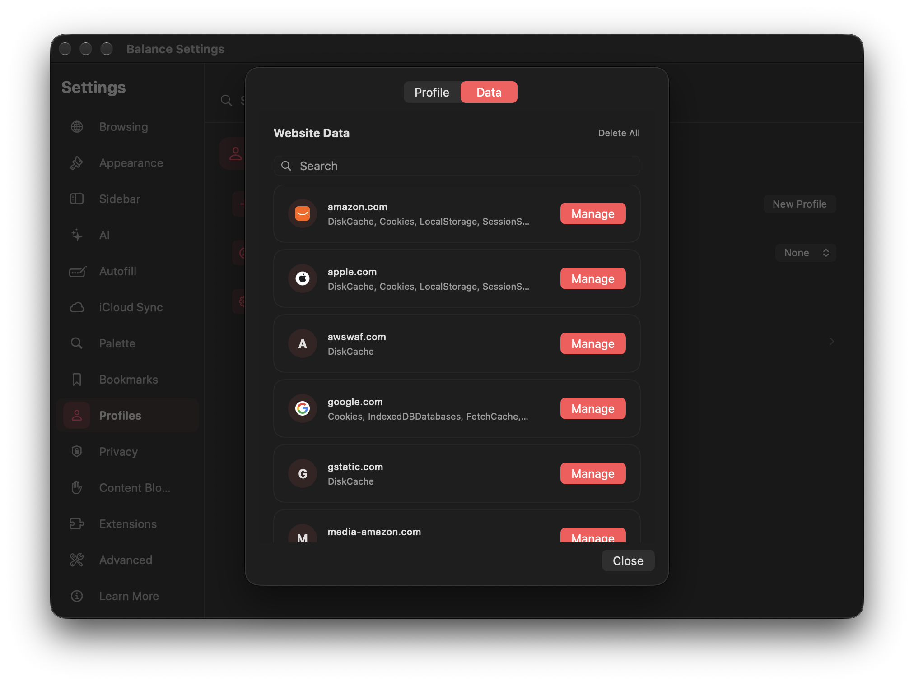

# Feature Guide

Balance Browser is a high-performance, native web browser built with SwiftUI and WebKit. It blends an elegant Liquid Glass user interface with on-device AI intelligence, deep productivity tooling, flexible workspace customization, and robust privacy protections.

## Support
Supports iOS, iPadOS, and macOS 26.0 and later, and can be downloaded on the [App Store.](https://apps.apple.com/us/app/balance-browser/id6789459733)

## Table of Contents

- [Productivity & Workspaces](#productivity--workspaces)
  - [Command Palette](#command-palette)
  - [Productive Sidebar](#productive-sidebar)
  - [Split View](#split-view)
  - [Customizable Toolbar](#customizable-toolbar)
  - [Focus Mode](#focus-mode)
  - [Built-In Notepad](#built-in-notepad)
  - [Tab Management & Spaces](#tab-management--spaces)
  - [Breadcrumbs Trail](#breadcrumbs-trail)
  - [Word & Text Analysis](#word--text-analysis)
- [Local On-Device AI](#local-on-device-ai)
  - [Private AI Chat](#private-ai-chat)
  - [Page Summarization](#page-summarization)
  - [Calendar Event Extraction](#calendar-event-extraction)
  - [Citation Generator](#citation-generator)
- [Browsing & Media Experience](#browsing--media-experience)
  - [Smart Address Bar & Engine Shortcuts](#smart-address-bar--engine-shortcuts)
  - [Reader Mode](#reader-mode)
  - [Page Restyling](#page-restyling)
  - [Native PDF Viewer](#native-pdf-viewer)
  - [Markdown & JSON Renderers](#markdown--json-renderers)
  - [Web Data & Storage Inspector](#web-data--storage-inspector)
  - [Password Manager & Autofill](#password-manager--autofill)
- [Sidebar Ecosystem & Integrations](#sidebar-ecosystem--integrations)
  - [Map Workspace](#map-workspace)
  - [RSS Feed Reader](#rss-feed-reader)
  - [IMAP Email Client](#imap-email-client)
  - [Live Weather](#live-weather)
  - [Calendar Integration](#calendar-integration)
  - [Shopping Inventory & Saved Items](#shopping-inventory--saved-items)
  - [In-App Page Translation](#in-app-page-translation)
  - [Downloads Manager with Dock Progress](#downloads-manager-with-dock-progress)
- [Profiles & Multi-Identity Browsing](#profiles--multi-identity-browsing)
  - [Independent Profiles](#independent-profiles)
  - [Ephemeral Sessions](#ephemeral-sessions)
- [Extensions & Customization](#extensions--customization)
  - [Chrome Extension Support](#chrome-extension-support)
  - [Liquid Glass Interface & Themes](#liquid-glass-interface--themes)
  - [Tab Layouts (Vertical, Compact, Top, Slide Over, Bottom)](#tab-layouts)
  - [Bookmark Bar Modes](#bookmark-bar-modes)
- [Privacy, Security & Cloud Sync](#privacy-security--cloud-sync)
  - [iCloud Synchronization](#icloud-synchronization)
  - [WebKit Content Blocking](#webkit-content-blocking)
  - [Site Permissions & Server Trust](#site-permissions--server-trust)
  - [Automatic Cleanup on Close](#automatic-cleanup-on-close)
- [macOS Integration & Automation](#macos-integration--automation)
  - [App Intents & Shortcuts](#app-intents--shortcuts)
  - [Handoff & Deep Linking](#handoff--deep-linking)

## Productivity & Workspaces

### Command Palette

Access actions, jump to open tabs, search bookmarks and browsing history, or run browser commands in milliseconds with `⌘ K`.

### Productive Sidebar

A unified, collapsible utility panel housing your frequently used tools and pinned websites. Customize which widgets appear and reorder them to match your workflow.

### Split View

View and interact with two websites simultaneously inside a single window. Adjust pane widths easily to compare documents, multitask, or cross-reference research.

### Customizable Toolbar

Tailor the top or bottom toolbar to your needs. Add, remove, and drag-and-drop rearrange items including Navigation, Share, Reload, Address Bar, Extensions, Split View, Command Palette, Find in Page, AI Tools, Restyle, Mute, Zoom, Breadcrumbs Trail, Word Count, Translation, and more.

### Focus Mode

Strip away all browser chromes, toolbars, and tab bars with `⌘ ⌥ F` to concentrate solely on the webpage content. Perfect for distraction-free reading, long-form writing, and deep study sessions.

### Built-In Notepad

Jot down quick thoughts, paste links, and organize notes without switching apps or losing context.

### Tab Management & Spaces

Balance provides a comprehensive tab engine:
- **Tab Layouts**: Choose from Top, Vertical, Slide Over, Compact, Bottom, or Hidden tab modes.
- **Spaces**: Group and organize related tabs into distinct contextual workspaces.
- **Tab Search (`⌘ ⌃ S`)**: Instantly search open tabs across all browser windows.
- **Tab Actions**: Duplicate tabs, move tabs to new windows, pin favorites, and reopen accidentally closed tabs (`⌘ ⇧ T`).

### Breadcrumbs Trail

Track your browsing journey across page transitions with an interactive navigation trail in your toolbar.

### Word & Text Analysis

Quickly inspect article length, word counts, and character statistics directly from the toolbar without copying text into third-party tools.

## Local On-Device AI

### Private AI Chat

Chat with an on-device local AI assistant directly in the sidebar. Get assistance with coding, summarizing, brainstorming, and translation—with zero telemetry and complete privacy.

*Customizable parameters include temperature, maximum token generation, page character context cutoffs, and custom system prompt instructions.*

### Page Summarization

Generate quick, structured summaries of lengthy articles, essays, and documentation with `⌘ /`.

### Calendar Event Extraction

Automatically parse dates, times, locations, and agendas from concert tickets, flight itineraries, webinars, or event invitations, and export them directly to your macOS Calendar with `⌘ ⌥ /`.

### Citation Generator

Extract bibliographic citations from academic papers, blogs, and news articles formatted ready for research bibliographies.

## Browsing & Media Experience

### Smart Address Bar & Engine Shortcuts

The address bar automatically classifies input as a valid URL, domain name, or search query. Configure custom keyword search prefixes (e.g. `g` for Google, `w` for Wikipedia, `ddg` for DuckDuckGo) for rapid targeted search.

### Reader Mode

Strip away ads, paywalls, and clutter for a pristine reading experience powered by Readability.js (`⌘ ⌥ R`).

### Page Restyling

Override web page typography, adjust foreground/background contrast, and apply custom accent palettes to improve readability and visual comfort.

### Native PDF Viewer

Open, scroll, zoom, and navigate local and remote PDF documents seamlessly using native Apple PDFKit.

### Markdown & JSON Renderers

View raw `.md` markdown files rendered into styled HTML formatting, and inspect structured JSON data with hierarchical syntax coloring and collapsible nodes.

### Web Data & Storage Inspector

Inspect and clear cookies, localStorage, session storage, and cache on a granular per-domain basis.

### Password Manager & Autofill

Securely store, autofill, and manage login credentials for your favorite websites directly in the sidebar and popover menus.

## Sidebar Ecosystem & Integrations

### Map Workspace

Extract geographic locations, businesses, and addresses mentioned in your open tabs and plot them interactively on Apple Maps.

### RSS Feed Reader

Subscribe to RSS feeds in your sidebar.

### IMAP Email Client

Connect your email accounts via IMAP to check unread email counts and browse recent messages in the sidebar without opening webmail tabs.

### Live Weather

Check real-time weather forecasts and conditions for configured cities without leaving your browsing session.

### Calendar Integration

View upcoming schedule entries and seamlessly sync web-extracted events into your local Apple Calendar.

### Inventory

Drop data into an list synced with iCloud.

### In-App Page Translation

Translate foreign-language web pages into your native language using native translation tools.

### Downloads Manager with Dock Progress

Track active downloads with progress bars, dock badge progress indicators, and instant Finder reveals.

## Profiles & Multi-Identity Browsing

### Independent Profiles

Separate your work, personal, and study activities. Each profile maintains its own:
- Cookies and local storage
- Bookmarks and sidebar favorites
- Toolbar layouts
- Search engines and shortcuts
- IMAP email accounts

### Ephemeral Sessions

Launch disposable, ephemeral profiles that automatically wipe all browsing sessions, cookies, and temporary data upon closing the window.

## Extensions & Customization

### Chrome Extension Support

Install and run compatible web extensions directly from the Chrome Web Store, with interactive popup overlays and toolbar action buttons.

### Liquid Glass Interface & Themes

Enjoy a modern macOS interface with translucency, subtle depth, and materials that blend into your desktop:
- **Theme Modes**: System, Light, Dark, or Match Page (adapts window tint to active webpage background).
- **Background Shapes**: Choose between Capsule or Rounded Rect corners.

### Tab Layouts

Configure tab bar behavior to suit your display and workflow:
- **Top**: Classic horizontal tab bar above the viewport.
- **Vertical**: Left-aligned vertical tabs with adjustable sidebar width.
- **Compact**: Space-saving unified address and tab bar.
- **Slide Over**: Floating drawer for rapid tab switching.
- **Bottom**: Tabs placed at the base of the window.
- **Hidden**: Maximize viewport area with tab navigation handled via palette or shortcuts.

### Bookmark Bar Modes

Customize bookmark bar visibility: **Always**, **New Tab Only**, or **Hidden**, with placement at either the top or bottom of the window.

## Privacy, Security & Cloud Sync

### iCloud Synchronization

Keep your entire browsing experience synchronized seamlessly across devices:
- History & Cloud Deletion
- Bookmarks & Pinned Sites
- Local AI Chats
- Sidebar & Toolbar Configurations
- User Profiles
- Browser Settings & Preferences
- Product Inventory
- Form Autofill & Search Engines
- Forget-on-Close Rules

### WebKit Content Blocking

Import custom WebKit content blocker JSON rule lists to block trackers, ads, and telemetry scripts at the network level.

### Site Permissions & Server Trust

Inspect SSL/TLS certificates and server trust status, and manage per-site permissions for camera, microphone, and geolocation.

### Automatic Cleanup on Close

Configure automated cleanup upon quitting Balance:
- Clear browsing history
- Clear download history
- Purge disk, memory, fetch, and service worker caches
- Clear cookies and session storage
- Automatically forget specific domain rules

## macOS Integration & Automation

### App Intents & Shortcuts

Balance integrates deeply with macOS Shortcuts, Siri, and Spotlight:
- **Open Bookmark in New Tab / Window**
- **Search Query**
- **Open URL**
- **Add Bookmark**
- **Open Private Window**

### Handoff & Deep Linking

- **Apple Handoff**: Continue active browsing sessions seamlessly across your Mac and iOS devices.
- **URL Schemes**: Launch URLs or initiate focus mode via `balance://<url>` and `balance-focus://<url>`.
- **Custom Files**: Double-click `.bpage` shortcut files to open saved URLs in new tabs.