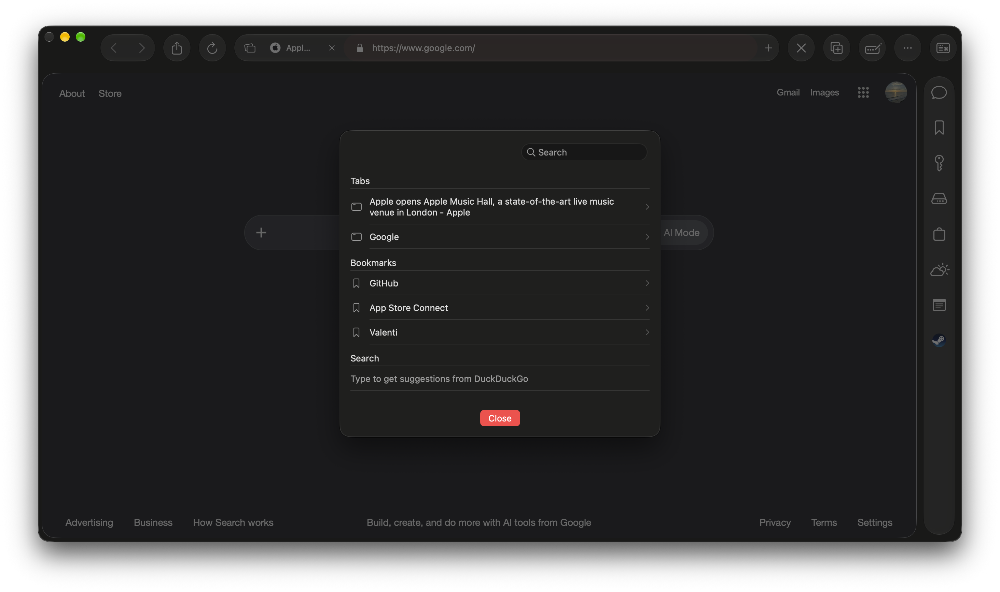
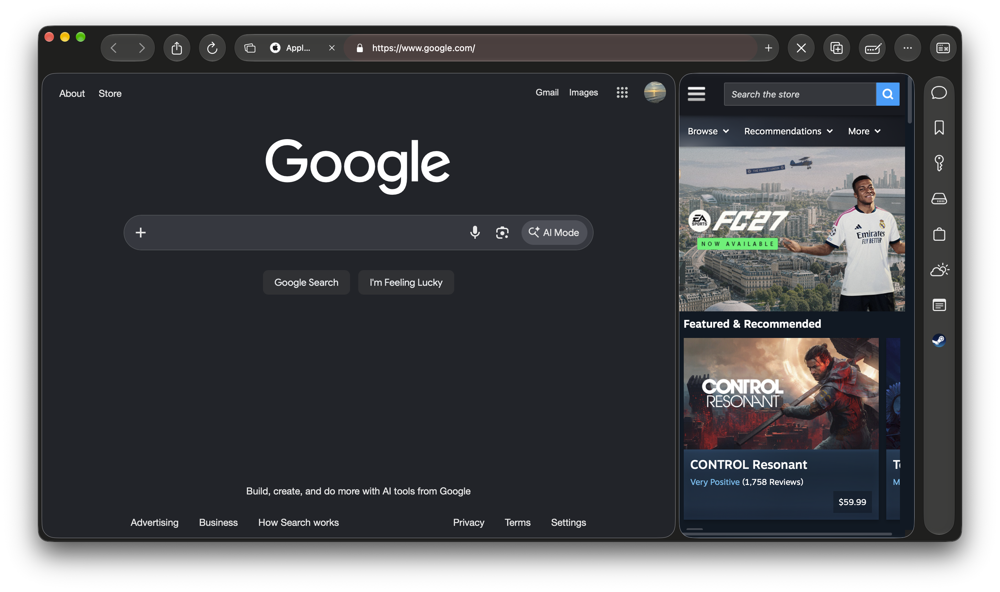
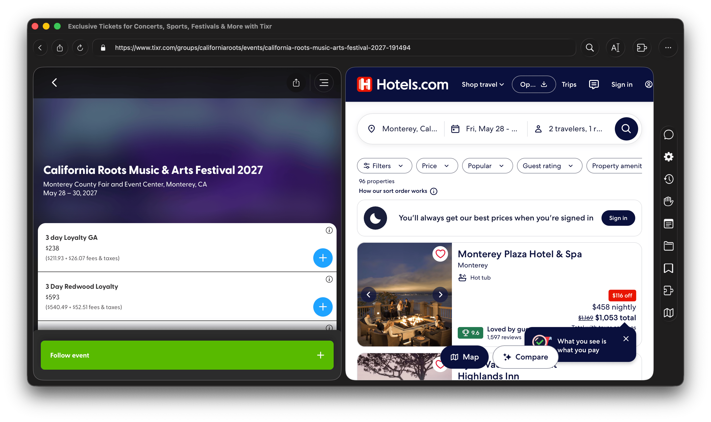
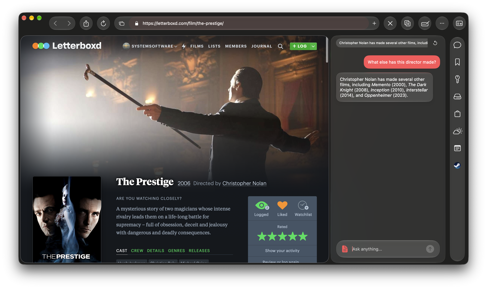
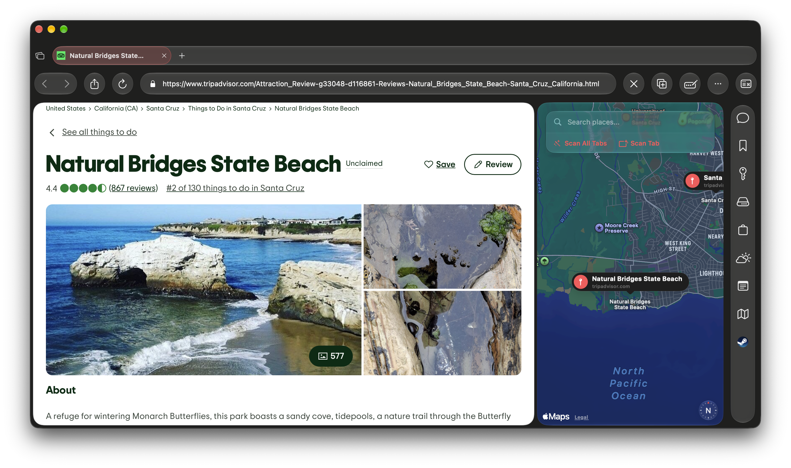
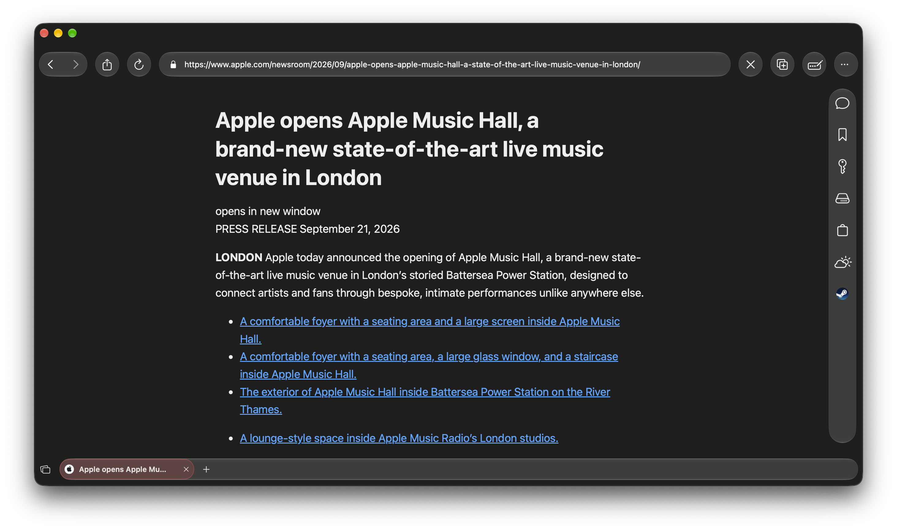

# Balance Browser

**Balance Browser** is a modern, productivity-focused web browser for macOS built with **SwiftUI** and **WebKit**. It combines a native macOS experience with integrated productivity tools—including AI, notes, history, and maps—all inside a customizable sidebar with a beautiful Liquid Glass interface.

## Features

### Productivity

#### Command Palette

Instantly search for browser commands, execute actions, and navigate efficiently.

#### Productive Sidebar

Access Notes, History, Downloads, and your favorite pinned websites from a single customizable sidebar.

#### Split View

Browse two websites side by side.

* Focus Mode for distraction-free browsing
* Built-in Notepad for quick notes
* Advanced tab management with Tab Search and detachable windows

### AI

#### Local AI Chat

Interact with a private, on-device AI assistant directly from your browser.

#### AI Page Summarization

* Quickly summarize long articles using local Apple Foundation Models.

* Event Extraction with one-click export to macOS Calendar

### Browsing

#### Map Workspace

Extract locations and real-world entities from open tabs and visualize them on an interactive map.

#### Reader Mode

A clean reading experience powered by Readability.js.

Additional browsing features include:

* Smart Address Bar
* Native PDF Viewer
* Chrome Extension support
* Multiple browser profiles
* User Agent switching
* Bookmark Bar customization
* Persistent browser settings
* Privacy controls with content blocking and site permissions
* Native Liquid Glass interface

## Keyboard Shortcuts

| Action        | Shortcut |
| ------------- | -------- |
| Palette       | `⌘ K`    |
| Go Back       | `⌘ →`    |
| Go Forward    | `⌘ ←`    |
| Reload Page   | `⌘ R`    |
| Find in Page  | `⌘ F`    |
| Share Link    | `⌘ ⇧ S`  |
| Copy Page URL | `⌘ ⌃ C`  |

## Tech Stack

* **SwiftUI**
* **WebKit** (`WKWebView`)
* **SwiftData**
* **AppStorage**
* **AppKit**
* **PDFKit**
* **Readability.js**

## Requirements

* macOS 26.0 (Tahoe) or later
* Xcode 26 or later

## Getting Started

1. Clone the repository.
2. Open the project in Xcode.
3. Select the macOS target.
4. Build and run (`⌘ R`).

### Configuration

Customize the browser from **Settings**, including:

* Homepage
* User Agent
* History recording
* Bookmark Bar mode
* Browser preferences

## License

Licensed under the MIT License. See **LICENSE** for details.

# Contact
Use discussions here, or email at support@coolstone.dev